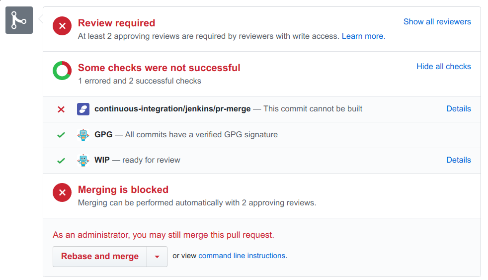
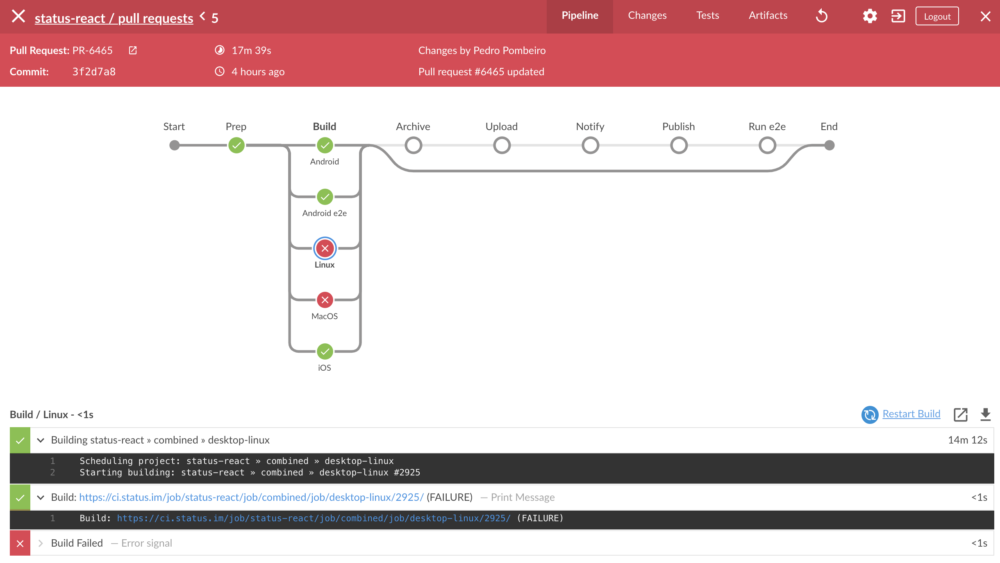

# Contribute to Status

This page should guide you through the initial steps of contributing to Status. Welcome to the window onto a better web, it's wonderful to see you!

## Help me!

>We know that getting set up and finding a bug which is a good fit for your skills can be a challenge. We're always looking for ways to open access, improve our processes and make it easier to participate in the open source community that is Status. If you're having any trouble following this documentation, or hit a barrier you can't get around, please ask in the #introduction room in [chat.status.im](https://chat.status.im) or contact andy@status.im. We're determined to solve hurdles for new contributors.

## What Skillz Do I Need?

Status is ambitious - we have a mobile app; a desktop app; we work deep down in Ethereum on both Light Clients and the Whisper protocol; and we are researching and building a new client in a language called Nim. If this seems like a lot, don't worry! It just means there are many different ways to contribute and a truly diverse array of skills we require.

*   If you know **Go**, you can contribute to [status-go](https://github.com/status-im/status-go/). This is where all of the blockchain logic, transactions, and light client work we do lives. 
*   If you know **Solidity** or **Vyper**, you can contribute to [status-contracts](https://github.com/status-im/ens-usernames) or directly to [Vyper](https://github.com/ethereum/vyper/) itself. ENS usernames, identity, voting, tribute to talk, DApp curation and a bunch of other use cases await intrepid smart contract engineers.
*   If you know **Clojure**, you can contribute to [status-react](https://github.com/status-im/status-react/). This is where we handle interactions between Whisper and the app; between the wallet, the user and any Distributed Application (DApp) that they want to access; and where the UI logic lives. The clean separation between data and functions offered in Clojure allows us to think broadly about what we can really build using decentralized networks and the right kinds of tools. If you're a [Clojurist](http://www.braveclojure.com/introduction/), you know why ;)
*   If you know **Clojure** and some **React Native QT**, you can contribute to [status-desktop](https://github.com/status-im/react-native-desktop), soon to be a part of the status-react repo. Desktop is one of our most exciting projects, because it will allow us to decentralize a lot of our current infrastructure and incentivise our users to run large parts of the networks from their own machines. This presents particularly interesting technical and cryptoeconomic problems and opportunities.
*   If you have know **Node** or **JavaScript**, you can contribute to [Embark](https://github.com/embark-framework/embark/). Embark is the most cutting-edge framework for developing DApps that currently exists. Contributing here means [getting to work](https://gitter.im/embark-framework/Lobby) with some of the most passionate, productive and talented engineers building developer tools for all of Ethereum.
*   If you are that very rare breed of human known as a **Nim** developer, you can contribute to the [status-nimbus](https://nimbus.team/) repositories. Alternatively, ping @arnetheduck in [chat.status.im](https://chat.status.im) and ask him what the Research team most needs help with.
*   If you have a background in **devops**, especially distributed systems, you can contribute to [status-infrastructure](https://github.com/status-im?utf8=%E2%9C%93&q=infra&type=&language=). The challenges of keep nodes synced to the network at all times are not to be underestimated, and this is potentially some of the most interesting work in distributed systems running in production anywhere in the world.
*   If you have a background in **security**, you can contribute to our ongoing efforts to make sure that things like Perfect Forward Secrecy are implemented properly and that everyone acting as a core contributor upholds the best practices required when working with public and adversarial networks.

## Step 1: Build Status for Android or iOS

This will require either a Mac or Linux machine. We recommend using Ubuntu for Linux. If you use another distro, that's great! It means you already have your first contribution opportunity - adapt our scripts as necessary for your distro and submit a PR!

Building a decentralized app for different mobile environments, using different PCs and Operating Systems is an adventure. However, we have put everything we can into a simple script and detailed everything else we can think of [here](/technical/build_status/).

Ping us in the [#developers channel in Status](https://join.status.im/chat/public/status-core-devs) itself if you can't build Status following that guide.

>If you're wanting to contribute to Embark it's best to go to [those specific docs](https://embark.status.im/). If you want to work on our smart contract and cryptoeconomic systems around Identity, Voting, ENS, Curation, and a bunch of other awesome things, then you can just start at Step 2.

## Step 2: Find Something To Work On

There are 3 ways you can get involved with the Status codebase: through Status Open Bounty, through finding bugs we've identified for beginners, or by fixing the stuff which irritates you most.

**Use Gitcoin**  
  
>So, you've got some experience as a developer, you've been eye-balling this whole crypto thing ever since that idiot Jim in your office told you about it over coffee a few years ago and you want to dip your toes into the water without taking the plunge? A lot of the smaller bugs and features we would like to fix are assigned as bounties at Status, which means you can earn some SNT for fixing issues as you learn your way around our code base. 
   
Simply go to [Gitcoin](https://gitcoin.co/explorer?network=mainnet&keywords=status&order_by=-web3_created), sign in using your GitHub profile and use the filters on that site to find recent issues that are both interesting to you and worth your time to fix.

**Find a bug we've identified as a suitable for new contributors**

All issues, feature requests and bugs are labelled in the same way across Status' repositories. This means if you set up a filter on the labels to look for `good-first-issue`s - which are most often easiest when they are simple `bug`s with `low-priority` - you can find some really good places to start.

Follow [this link](https://github.com/status-im/status-react/issues?utf8=%E2%9C%93&q=is%3Aopen+label%3A%22good+first+issue%22+label%3A%22bug%22+label%3A%22low-priority%22+) to see how it is done.

**Build the Stuff You Need Most**

If there's something you'd like to see included or fixed properly in Status, Desktop, or your other favorite Status project, starting with whatever irritates you, or the thing you most want to see in Status can be a great method:

Search our repository for [relevant keywords](https://github.com/status-im/status-react/issues?utf8=%E2%9C%93&q=is%3Aissue+is%3Aopen+keyboard+android). The link provided demonstrates how to do so.

Either comment on the issue related to your pet peeve, or create a new issue and ask for the info you need to start working on it. Best is to look at our [most active contributors](https://github.com/status-im/status-react/graphs/contributors), and tag one of them for more details. Alternatively, just ask in the [#developers channel in Status](https://join.status.im/chat/public/status-core-devs).

Bugs or features listed as 'Assigned' are not usually a good place to start, unless you're sure you have something worthy to contribute. Even with no assignee, it is polite to check if someone has recently commented that they're looking at fixing the issue.

Once you have found something to work on, please comment on it. Let the bug submitter and any potential reviewers know that you'd like to work on it and you might receive some extra information and be made the assignee.

## Step 3: Fix the Bug

This is where the adventure begins, and we feel confident now leaving this in your capable hands. 

**Pull request content**

Pull requests should be linked to the issues they fix and the branches they come from should be named `fix/#123`. This can be achieved easily with this template:  

>**commit name**: [#123] sldfjdsfj  
**PR title**: same as the commit name  
**PR comment**: starts with `Fixes #123` for easier issue navigation

Once submitted, PRs are generally tracked through GitHub Project Boards. You can, for instance, find the status-react kanban board we maintain [here](https://github.com/status-im/status-react/projects/7). This allows us to track each PR through the lifecycle of contributor>review->to test->in testing->merge which we follow.

Otherwise, you can:

*   Ask for help in a comment on the bug, or in #introduction or in the [#status-core-devs channel in Status](https://join.status.im/chat/public/status-core-devs)

## Step 4: Get Your Code Reviewed

We use a [trunk based](https://paulhammant.com/2013/04/05/what-is-trunk-based-development/) development model. We review PRs with great care; the ultimate goal being zero regressions.

**Definition of done**

To be considered ready for review, a pull request must:

*   not define TODOs
*   have automated tests where relevant
*   have commented code
*   provide documentation
*   include screenshots or demos where relevant
*   perform manual tests if necessary.

**Pull request lifecycle**

Once submitted, a pull request will go through a review cycle. Whenever possible checks are automated, e.g.

*   compilation / unit tests execution via Jenkins
*   code quality
*   patterns usage

Once our automated checks pass, the pull request will be reviewed by our Testing team.

A reviewer might request changes. If agreement emerges, an individual commit is created to simplify follow up reviews. All commits are squashed into a single commit for final merge.

## Step 5: Respond to the review

For most new contributors, even for long time Status contributors, the first review of your patch will likely require some changes. It does not mean you've done bad work. There is just almost always more work to do before the code can be merged into our codebase.

>This is an important process, so don't be discouraged! Because we're building new technologies, care about what we merge and close attention to helping contributors write good patches are critical to the long-term success of Status as a sustainable open source project. Make any changes your reviewer requests; if you're unsure how, just ask whoever has reviewed your code - we're all about active collaboration. 

## Step 6: Repeat

Thank you! You've fixed your very first bug, and web3 is stronger for it. But don't stop now...

Go back to Step 3, as there is plenty more to do. Your reviewer might suggest a new bug for you to work on, or you can find one that interests you. Now that you've got your first bug fixed, you should have contributor rights in the repository, and we look forward to seeing how much further down this decentralized rabbit hole you want to fall. Welcome to a better web!

## Debugging Errors

If your build fails in our CI (Continuous Integration) system you can look up the results yourself.
Simply scroll down to the bottom of your PR and see the `continuous-integration/jenkins/pr-merge` section and click the __Details__ link.

  

This should take you to the [Jenkins Blue Ocean](https://jenkins.io/projects/blueocean/) view of your PR build:  

